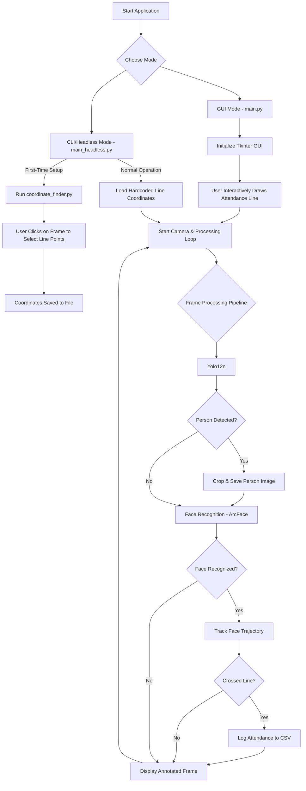

# An Automated Dual-Mode Attendance and Surveillance System using Deep Learning

## Abstract

This paper presents a robust, dual-mode system for automated attendance tracking and intelligent surveillance. The system leverages deep learning models for real-time face recognition and person detection. It operates in two distinct modes: a graphical user interface (GUI) mode for interactive setup and monitoring, and a command-line interface (CLI) mode for headless, resource-efficient deployment. The core functionality includes identifying individuals using the ArcFace recognition model, tracking their entry and exit across a predefined virtual line, and logging attendance with timestamps. Additionally, the system integrates a YOLOv8 model to detect persons of interest and automatically captures high-quality, cropped images for security and verification purposes. The modular architecture, implemented in Python, ensures scalability and ease of maintenance. This paper details the system's methodology, workflow, and architecture, demonstrating its effectiveness as a flexible solution for modern surveillance and attendance management.

## 1. Introduction

Automated attendance and surveillance systems are critical in various sectors, including corporate, educational, and public security. Traditional methods are often manual, inefficient, and prone to errors. This project introduces an intelligent system that automates these processes using state-of-the-art deep learning techniques. The primary contribution is a flexible, dual-mode architecture that supports both interactive (GUI) and standalone (CLI) operation, catering to different deployment scenarios. The system not only tracks attendance via face recognition but also enhances security by detecting and capturing images of all persons in the camera's view.

## 2. Methodology

The system is built on a modular Python framework, integrating several key technologies to achieve its objectives.

### 2.1. Face Recognition Engine

The core of the attendance system is its face recognition capability, powered by the **InsightFace** library with the **ArcFace (buffalo_l)** model. The process is as follows:

1.  **Database Creation**: Face embeddings for authorized individuals are pre-computed from source images stored in the `employee` directory. These known embeddings are loaded into memory at startup.
2.  **Real-time Detection**: For each frame from the video stream, the system detects all visible faces.
3.  **Embedding and Comparison**: A 512-dimension feature vector (embedding) is generated for each detected face. This vector is compared against the database of known embeddings using **cosine similarity**.
4.  **Identification**: A match is confirmed if the similarity score surpasses a predefined `SIMILARITY_THRESHOLD` (e.g., 0.35). The identified person's name is then used for attendance logging.

### 2.2. Person Detection and Image Capture

To enhance surveillance capabilities, the system incorporates a lightweight yet powerful object detection model.

1.  **YOLOv12 Integration**: The **YOLO 12-Nano** model (`yolo12n.pt`) is used for real-time person detection. It is optimized for high-speed inference on CPU.
2.  **Targeted Detection**: The model is configured to detect only the 'person' class, ignoring other objects to reduce computational overhead.
3.  **Automated Cropping and Saving**: When one or more persons are detected, the system isolates each individual by cropping the high-resolution, unprocessed frame using their bounding box coordinates. Each cropped image is saved to a structured directory: `Person Image/YYYY-MM-DD/HH-MM-SS_person_N.jpg`. This ensures a clean, focused image is stored for archival or review.

### 2.3. Attendance Tracking Algorithm

Attendance is logged based on a virtual line-crossing mechanism.

1.  **Virtual Line**: A line is defined by two coordinates (start and end points) on the video frame.
2.  **Trajectory Tracking**: The system maintains a short history of the centroid coordinates for each recognized face.
3.  **Intersection Logic**: An attendance event is triggered when the trajectory of a recognized person intersects the virtual line. The direction of crossing determines whether the event is a 'login' or a 'logout'.
4.  **Data Logging**: To ensure data integrity, the system logs only the **first login** and the **last logout** for each unique individual per day. Attendance records are saved in a daily CSV file (`attendance_YYYY-MM-DD.csv`).

## 3. System Architecture and Workflow

The system's architecture is designed for modularity and flexibility, supporting two primary operational modes.

### 3.1. Modular Components

-   `config.py`: A centralized file for all user-configurable parameters (camera URL, thresholds, file paths).
-   `utils.py`: Contains helper functions, including loading known faces and the line intersection algorithm.
-   `attendance_system.py`: The main class encapsulating the core logic for face recognition and attendance.
-   `main.py` / `main_headless.py`: Entry points for the GUI and CLI modes, respectively.
-   `coordinate_finder.py`: A standalone utility to help users select and save line coordinates for the headless mode.

### 3.2. Workflow Diagram

### 3.3. Operating Modes

-   **GUI Mode**: Launched via `main.py`, this mode provides a full graphical interface using Tkinter. It allows users to draw the attendance line directly on the video feed with a mouse, making it ideal for demonstrations, debugging, and interactive setup.

-   **CLI/Headless Mode**: Launched via `main_headless.py`, this mode operates without a dedicated GUI, displaying the video feed in a standard OpenCV window. It relies on a pre-configured file for the attendance line coordinates, which can be generated using the `coordinate_finder.py` utility. This mode is optimized for long-term, resource-efficient deployment on servers or embedded devices where user interaction is minimal.

## 4. Conclusion

This paper details an automated, dual-mode system that effectively combines face recognition for attendance tracking with person detection for enhanced surveillance. Its modular design and flexible operating modes make it a highly adaptable solution for various real-world scenarios. Future work could include optimizing performance for multi-camera setups, integrating anti-spoofing measures to prevent fraudulent check-ins, and developing a web-based dashboard for remote monitoring and analytics.
